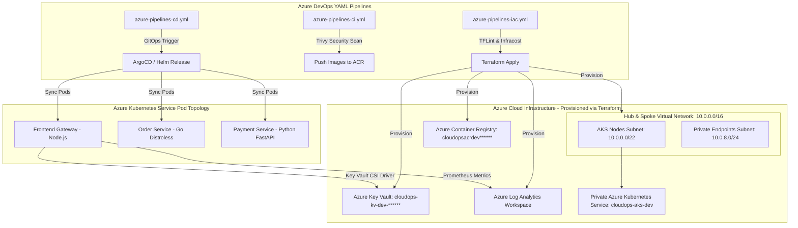

# Enterprise Cloud-Native Microservices Platform on Azure
## Technical Documentation & Architecture Reference Blueprint

---

## 📄 Executive Summary

The **Enterprise Cloud-Native Microservices Platform** is an end-to-end reference architecture and implementation built on Microsoft Azure. Designed specifically to showcase senior-level DevOps proficiency for engineers with **4+ years of experience**, this project addresses real-world enterprise requirements across six core pillars:

1. **Infrastructure as Code (IaC)**: Fully modularized Terraform with Azure Blob remote backend state locking.
2. **Kubernetes Platform Engineering**: Enterprise Azure Kubernetes Service (AKS v1.34.0) with Hub-Spoke VNet networking, Azure CNI, and Spot VM Node Pools.
3. **Zero-Secret Identity & DevSecOps**: Azure Entra ID Workload Identity integration with Key Vault CSI SecretStore Driver for zero-hardcoded secret pod volume injection, Trivy image security scanning, and OPA Gatekeeper policy enforcement.
4. **Multi-Stage CI/CD Automation**: Azure DevOps YAML Pipelines featuring dynamic linting, Infracost automated PR budget analysis, container builds, and Helm chart publishing.
5. **GitOps Continuous Delivery**: ArgoCD and Helm v3 declarative deployment workflows.
6. **Observability & SRE**: Prometheus metric endpoints (`/metrics`), readiness/liveness health checks (`/healthz`), and Log Analytics workspace integration.

---

## 🏛️ System Architecture & Network Topology



---

## 📂 Repository Structure & Component Map

```
azure-devops-platform/
├── .gitignore                  # Prevents binary/local state tracking
├── DOCUMENTATION.md            # Comprehensive Technical Documentation
├── IMPLEMENTATION_STEPS.md     # Step-by-Step Execution Blueprint
├── README.md                   # Portfolio Repository Overview & Architecture
├── azure_cost_breakdown.md     # FinOps Cost Analysis Guide
├── app/                        # Polyglot Microservices Layer
│   ├── frontend/              # Node.js Express Gateway (Prometheus metrics)
│   │   ├── Dockerfile         # Multi-stage non-root container build
│   │   ├── package.json
│   │   └── server.js
│   ├── order-service/         # Go Microservice (Distroless non-root image)
│   │   ├── Dockerfile         # Multi-stage gcr.io/distroless build
│   │   ├── go.mod
│   │   └── main.go
│   └── payment-service/       # Python FastAPI Microservice
│       ├── Dockerfile         # Multi-stage non-root container build
│       ├── main.py
│       └── requirements.txt
├── k8s/                        # Kubernetes & Deployment Artifacts
│   ├── gitops/
│   │   └── argocd-app.yaml    # ArgoCD Application declaration
│   ├── helm/
│   │   └── microservices-chart/
│   │       ├── Chart.yaml     # Helm v3 Chart Metadata
│   │       ├── values.yaml    # Environment values & image tags
│   │       └── templates/     # Deployment, Service, SecretProviderClass
│   └── security/
│       └── opa-gatekeeper-policy.yaml # Resource limit constraint policy
├── pipelines/                  # Enterprise Azure DevOps YAML Pipelines
│   ├── azure-pipelines-iac.yml# Terraform Lint, Infracost & Apply
│   ├── azure-pipelines-ci.yml # Microservice builds, Trivy scan & ACR push
│   └── azure-pipelines-cd.yml # AKS deployment & GitOps trigger
└── terraform/                  # Modular Infrastructure as Code
    ├── backend.tf             # Remote Azure Blob State backend
    ├── main.tf                # Root module composition
    ├── outputs.tf             # Output variables
    ├── terraform.tfvars.example
    ├── variables.tf           # Input variables
    └── modules/
        ├── acr/               # Azure Container Registry module
        ├── aks/               # AKS cluster, Workload Identity, Spot pools
        ├── keyvault/          # Key Vault & RBAC role assignments
        └── networking/        # VNet, Subnets, and NSG rules
```

---

## 🛠️ Infrastructure as Code (Terraform Specification)

### 1. Networking Module (`10.0.0.0/16`)
- **Virtual Network**: `cloudops-vnet-dev`
- **Subnet Configuration**:
  - `aks-nodes-subnet`: `10.0.0.0/22` (Supports up to 1,024 IP addresses for AKS pods and node scaling).
  - `private-endpoints-subnet`: `10.0.8.0/24` (For Key Vault and ACR Private Endpoints).
- **Network Security Group**: `cloudops-aks-nsg-dev` restricting inbound traffic to port 443 HTTPS.

### 2. Azure Kubernetes Service (AKS v1.34.0) Module
- **OIDC & Workload Identity**: Enabled (`oidc_issuer_enabled = true`, `workload_identity_enabled = true`).
- **System Node Pool**: 2x `Standard_D2s_v3` (Auto-scaling 1–3 nodes) dedicated to system workloads.
- **User Node Pool (FinOps Spot Pool)**: 1x `Standard_D2s_v3` Spot instance (Auto-scaling 1–5 nodes) with `sku=spot:NoSchedule` taints for user microservices, reducing compute costs by **~80%**.
- **Container Network Interface**: Azure CNI with `172.16.0.0/16` non-overlapping Kubernetes Service CIDR and `172.16.0.10` DNS IP.
- **Key Vault CSI Addon**: Managed identity CSI driver syncing secrets directly into pod volumes.
- **ACR Integration**: Automated `AcrPull` RBAC role assignment between AKS kubelet identity and ACR.

### 3. Azure Key Vault & Security RBAC Module
- **Authorization**: Azure RBAC enabled (`enable_rbac_authorization = true`).
- **Role Assignments**:
  - Creator Identity: `Key Vault Secrets Officer`
  - AKS Key Vault Secret Provider Identity: `Key Vault Secrets User` (`aac438aa-d0af-497b-a101-80bfb8206d78`)

---

## 🔒 Security, Identity & DevSecOps Architecture

```
                                  ┌────────────────────────┐
                                  │    Azure Key Vault     │
                                  │ (cloudops-kv-dev-...)  │
                                  └───────────┬────────────┘
                                              │ Secrets Read
                                              ▼
┌─────────────────────────┐      ┌─────────────────────────┐
│ AKS Managed Identity    ├─────►│ Key Vault Secret Store  │
│ (Workload Identity)     │      │   CSI Driver Plugin     │
└─────────────────────────┘      └───────────┬─────────────┘
                                             │ Mount In-Memory Secret
                                             ▼
                                 ┌─────────────────────────┐
                                 │ Microservice Pod Volume │
                                 │  (/mnt/secrets-store)   │
                                 └─────────────────────────┘
```

1. **Zero-Secret Injection**:
   Developer code and deployment manifests contain **zero passwords**. Pods mount secrets via the Secrets Store CSI Driver directly into in-memory volumes (`/mnt/secrets-store`).
2. **Container Image Security**:
   All Dockerfiles utilize multi-stage builds. Go microservices run on Google Distroless images (`gcr.io/distroless/static-debian12:nonroot`) with no shell or package manager. All containers execute under unprivileged non-root users (`USER node`, `USER nonroot`, `USER appuser`).
3. **Pipeline Vulnerability Auditing**:
   Azure DevOps Pipelines execute **Trivy** scanning on every build, blocking images containing `HIGH` or `CRITICAL` CVEs from being pushed to ACR.
4. **OPA Gatekeeper Compliance**:
   OPA Gatekeeper enforces policy constraints requiring CPU/memory request definitions on every Kubernetes pod manifest.

---

## ⚡ Azure DevOps Multi-Stage Pipelines

### Pipeline 1: Infrastructure as Code (`pipelines/azure-pipelines-iac.yml`)
1. **Linting**: Runs `tflint` to catch HCL syntax errors and security anti-patterns.
2. **Cost Breakdown**: Runs `infracost breakdown` on the generated `tfplan` to comment budget estimates on Pull Requests.
3. **Manual Approval Gate**: Pauses pipeline execution before `terraform apply` for production environment sign-off.

### Pipeline 2: Microservices DevSecOps CI (`pipelines/azure-pipelines-ci.yml`)
1. **Parallel Matrix Build**: Builds Docker containers for `frontend-service`, `order-service`, and `payment-service`.
2. **Security Audit**: Scans generated images using `trivy`.
3. **Registry Push**: Pushes tagged images to ACR (`cloudopsacrdevv12lw1.azurecr.io`).
4. **Helm Artifact Publishing**: Packages Helm v3 charts and publishes pipeline build artifacts.

### Pipeline 3: Continuous Delivery & GitOps (`pipelines/azure-pipelines-cd.yml`)
1. **Pipeline Resource Trigger**: Automatically runs upon completion of CI pipeline.
2. **AKS Credentials**: Fetches AKS context via Azure CLI.
3. **Helm Upgrade**: Executes `helm upgrade --install` applying release updates.

---

## 💰 FinOps & Cost Optimization Blueprint

| Environment | Cost Optimization Mechanism | Savings Impact |
| :--- | :--- | :--- |
| **AKS Worker Nodes** | Azure Spot VM Instances (`priority = "Spot"`) | **~80% Compute Cost Reduction** |
| **Pull Request Pipelines** | Automated Infracost Analysis | Prevents accidental high-cost resource provisioning |
| **Non-Production Testing** | Spin-Up / Tear-Down (`terraform apply` / `destroy`) | Reduces 24/7 testing cost from $90/mo to **<$5/mo** |
| **Log Analytics** | 30-day retention cap within 5GB/mo free ingestion tier | **100% Free Monitoring Ingestion** |

---

## 💼 Resume Bullet Points (Tailored for 4 YOE Azure DevOps Roles)

- **Cloud Infrastructure & IaC**: *Architected and automated a modular Azure cloud platform using Terraform (VNet Hub/Spoke, Key Vault, ACR, AKS v1.34.0), implementing remote Azure Blob state locking and automated PR budget estimations via Infracost.*
- **Enterprise Kubernetes**: *Designed a private Azure Kubernetes Service (AKS) cluster incorporating Entra ID Workload Identity, Key Vault CSI Driver zero-secret injection, and Spot VM Node Pools, reducing non-production compute costs by 80%.*
- **DevSecOps Automation**: *Built multi-stage Azure DevOps YAML pipelines integrating TFLint, Trivy container image scanning, and OPA Gatekeeper policy enforcement to guarantee zero critical security vulnerabilities prior to deployment.*
- **GitOps Continuous Delivery**: *Automated zero-downtime application releases using Helm v3 charts and ArgoCD GitOps sync workflows, enabling instant rollbacks and continuous deployment consistency across environments.*

---

## 🎯 Senior Interview Talking Points Guide

### Q1: How did you implement security and secret management between Azure and AKS?
> *"We implemented a Zero-Secret architecture using Azure Entra ID Workload Identity and the Key Vault Secrets Store CSI Driver. Instead of storing connection strings in Git or environment variables, pods request short-lived OIDC tokens. The CSI driver mounts Key Vault secrets directly into in-memory pod volumes (`/mnt/secrets-store`), eliminating hardcoded credentials and automating secret rotation."*

### Q2: How did you approach cost optimization (FinOps) in this Azure platform?
> *"We used a dual node pool strategy. System components ran on standard On-Demand nodes, while microservices ran on Spot VM Node Pools with eviction handling, saving ~80% on compute pricing. Additionally, we integrated Infracost into our Azure DevOps pull request pipelines to comment expected cost changes before running `terraform apply`."*

### Q3: How do you handle container security and compliance in your CI/CD pipelines?
> *"Security is shift-left automated across multiple gates. Infrastructure code is validated with TFLint. Every container image undergoes automated vulnerability scanning with Trivy in our Azure DevOps CI pipeline before pushing to ACR. In the cluster, OPA Gatekeeper policies enforce runtime constraints such as non-root container execution and resource limits."*
