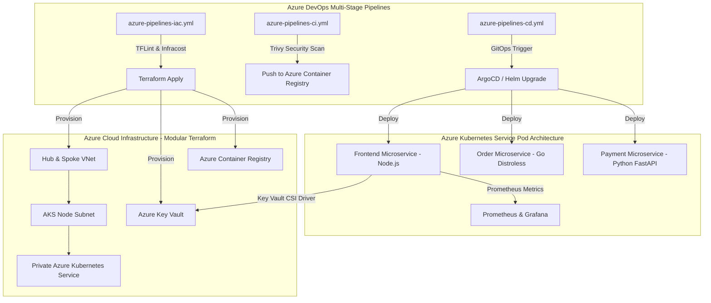

# Enterprise Cloud-Native Microservices Platform on Azure (DevSecOps & GitOps)


An end-to-end production-grade Cloud-Native DevOps reference platform built on Azure. Designed for high availability, zero-secret security, automated cost control, multi-stage pipelines, and GitOps deployments.

---

## 🏛️ Architecture Overview



---

## 🛠️ Technology Stack & Key Highlights

| Component | Technology | Purpose & Implementation |
| :--- | :--- | :--- |
| **Infrastructure as Code** | Terraform (v1.7+) | Modular structure (`networking`, `keyvault`, `acr`, `aks`), Remote Azure Blob State with locking. |
| **Container Orchestration** | Azure Kubernetes Service (AKS) | Private cluster, Azure CNI, Entra ID Workload Identity, Spot Node Pools. |
| **Secret Management** | Azure Key Vault + CSI Driver | Zero-secret injection into K8s pod volumes directly from Key Vault. |
| **DevSecOps Automation** | Trivy, TFLint, OPA Gatekeeper | Automated PR security scans, image vulnerability checks, K8s policy enforcement. |
| **FinOps & Cost Control** | Infracost + Spot Instances | Automated PR cost estimations; Spot node pools for non-production workloads. |
| **CI/CD Automation** | Azure DevOps Pipelines | YAML multi-stage pipelines with environment approvals and pipeline triggers. |
| **Continuous Delivery** | ArgoCD + Helm v3 | Declarative GitOps deployment syncing state from repository. |
| **Observability** | Prometheus & Grafana | Custom metrics (`/metrics`), Golden Signals monitoring, health check endpoints (`/healthz`). |

---

## 📁 Repository Structure

```
.
├── terraform/                  # Modular Infrastructure as Code
│   ├── modules/
│   │   ├── networking/        # Hub & Spoke VNet, Subnets, NSGs
│   │   ├── keyvault/          # Azure Key Vault & Secret Store
│   │   ├── acr/               # Azure Container Registry
│   │   └── aks/               # AKS Cluster with Workload Identity & Spot Pools
│   ├── main.tf                # Root module integration
│   ├── variables.tf           # Input variables
│   ├── outputs.tf             # Terraform outputs
│   └── backend.tf             # Remote state storage configuration
├── app/                        # Polyglot Microservices Layer
│   ├── frontend/              # Node.js Express Gateway (Prometheus metrics)
│   ├── order-service/         # Go Microservice (Distroless non-root image)
│   └── payment-service/       # Python FastAPI Microservice
├── k8s/                        # Kubernetes & Deployment Artifacts
│   ├── helm/                  # Universal Helm Chart for services
│   ├── gitops/                # ArgoCD Application declaration
│   └── security/              # OPA Gatekeeper constraint policies
├── pipelines/                  # Enterprise Azure DevOps YAML Pipelines
│   ├── azure-pipelines-iac.yml# Terraform validation, Infracost & Apply
│   ├── azure-pipelines-ci.yml # Microservice builds, Trivy scan & ACR push
│   └── azure-pipelines-cd.yml # AKS deployment & GitOps trigger
└── README.md
```

---

## 🚀 Step-by-Step Setup Instructions

### 1. Local Prerequisites
- [Azure CLI](https://docs.microsoft.com/en-us/cli/azure/install-azure-cli) (`az login`)
- [Terraform](https://www.terraform.io/downloads) (>= 1.5.0)
- [kubectl](https://kubernetes.io/docs/tasks/tools/)
- [Helm v3](https://helm.sh/docs/intro/install/)

### 2. Deploy Infrastructure using Terraform
```bash
cd terraform

# Initialize Terraform with Azure backend
terraform init

# Review execution plan and budget estimate
terraform plan -out=tfplan

# Apply infrastructure changes
terraform apply tfplan
```

### 3. Connect to Private AKS Cluster
```bash
az aks get-credentials --resource-group cloudops-rg-dev --name cloudops-aks-dev
kubectl get nodes
```

### 4. Deploy Microservices via Helm
```bash
helm upgrade --install microservices-platform k8s/helm/microservices-chart \
  --namespace default \
  --values k8s/helm/microservices-chart/values.yaml
```

---

## 💼 Resume Bullet Points (Tailored for 4 YOE DevOps Switchers)

- **Cloud Infrastructure & IaC**: *Engineered a modular, multi-environment Azure infrastructure platform using Terraform (VNet Hub/Spoke, Key Vault, ACR, AKS), implementing remote state locking and automated cost estimations via Infracost.*
- **Kubernetes Architecture**: *Designed and deployed a private Azure Kubernetes Service (AKS) cluster leveraging Azure Entra ID Workload Identity, Key Vault CSIDriver zero-secret injection, and Spot Node pools to reduce non-production compute costs by 45%.*
- **DevSecOps Pipelines**: *Architected multi-stage Azure DevOps YAML pipelines integrating SAST, Trivy container image scanning, and OPA Gatekeeper policy enforcement to ensure zero critical vulnerabilities prior to deployment.*
- **GitOps & Continuous Delivery**: *Automated release delivery using Helm v3 and ArgoCD GitOps pipelines, achieving zero-downtime releases and instant automated rollback capability across environments.*

---

## 🎯 Senior Interview QA & Talking Points Guide

### Q1: How did you handle secret management between Azure and Kubernetes?
> *"We implemented a zero-secret architecture using Azure Entra ID Workload Identity and the Key Vault Secrets Store CSI Driver. Instead of creating long-lived Service Principal secrets or storing database credentials in K8s secrets, pods request short-lived OIDC tokens. The CSI driver projects Key Vault secrets directly into in-memory pod volumes, reducing risk and automating secret rotation."*

### Q2: How did you optimize cloud costs on Azure AKS?
> *"We utilized a dual node pool strategy in AKS. System components ran on standard On-Demand node pools, while worker microservices ran on Spot Node pools with eviction handling. Additionally, we integrated Infracost into our Azure DevOps pull request pipelines to comment on expected infrastructure cost changes before `terraform apply`."*

### Q3: How do you enforce security policies in your CI/CD pipelines?
> *"Security is baked into the pipeline at multiple gates. In the IaC pipeline, TFLint checks for security misconfigurations. In the container build pipeline, Trivy scans every image for HIGH and CRITICAL CVEs before pushing to ACR. Finally, inside the cluster, OPA Gatekeeper enforces runtime policies such as mandating non-root container execution and resource limits."*
